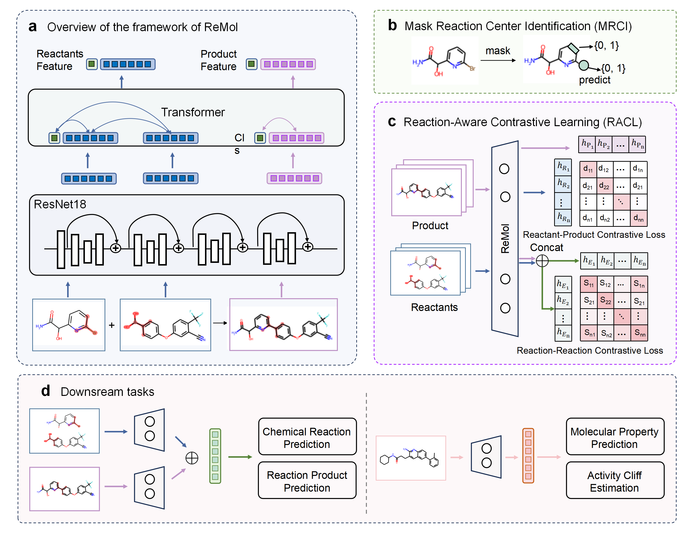

# ReMol



## Install environment

**1. GPU environmentx**<br>  
CUDA 11.1

**2. create a new conda environment**<br>  
conda create -n ReMol python=3.7<br>  
conda activate ReMol  

**3. download some packages**<br>  
pip install -r requirements.txt<br>  
source activate ReMol  

## Pretraining
Download [pretraining data](https://drive.google.com/file/d/188ulJv3Vz8p75hB2GSrsSFfgYrJMv7KG/view?usp=drive_link) and put it into ./datasets/pretrain/<br>  
**1. get masking atom/bond image for mask reaction center identification**<br>  
```
python ./process/mask_center_lmdb.py.py --jobs 15
```
**Note:** You can find the uspto_pretrain in ./datasets/pretrain, and we provide uspto_pretrain_toy in our pretraining data.<br>  

**2. start to pretrain**<br>  
Code to pretrain:<br>  
```
python pretrain.py --nodes 1 \
                   --ngpus_per_node 4 \
                   --gpu 0,1,2,3 \
                   --batch 128 \
                   --epochs 50 \
                   --RPCL_lambda 1 \
                   --RRCL_lambda 1 \
                   --MRCI_lambda 1 \
```
## Finetuning

**1.  downstream dataset**<br>  
All processed finetuning datasets can be download in [link](https://drive.google.com/file/d/1I2O0AhTO3CGaYMsQl_EnKusmJw6ZXC8y/view?usp=sharing), and put it into ./datasets/finetuning/<br>  
| Task                             | Dataset     | Original download link | Description |
|----------------------------------|-------------|------------------------|-------------|
| reaction product prediction      | USPTO-479k  |   [MolR](https://github.com/hwwang55/MolR/blob/master/data/USPTO-479k/USPTO-479k.zip)                    |     The dataset contains 478,612 chemical reactions, divided into training, validation, and test sets, containing 408,673, 29,973, and 39,966 reactions respectively.        |
| chemical reaction classification | Schneider   |   [DRFP](https://pubs.acs.org/doi/suppl/10.1021/ci5006614/suppl_file/ci5006614_si_002.zip)                     |  The dataset contains 38,800 chemical reactions, divided into training, validation, and test sets, containing 31,002, 3,896, and 3,902 reactions respectively.           |
| molecular property prediction    | MoleculeNet |   [KPGT](https://figshare.com/s/aee05cc329434b629c82)                    |   These datasets, eight are designed for classification tasks and the remaining three are designed for regression tasks.          |
| activity cliff estimation        | MoleculeACE |   [MoleculeACE](https://github.com/molML/MoleculeACE/tree/main/MoleculeACE/Data/benchmark_data)                    |   Each cluster was then split into a training set (80\%) and a testing set (20\%) using stratified random sampling based on the activity cliff label.          |

**2.  Download pre-trained ReMol**<br>  
You can download pre-trained model [ReMol](https://drive.google.com/file/d/1WuL3TP2tW2c2QF7vVPnj-FLZqEobZIql/view?usp=sharing) and push it into the folder ckpts/ <br> 

**3. Finetune with pre-trained ReMol on various downstream tasks** <br>  
For example, you can run the following code to chemical reaction classification:
```
python finetuning_reaction_classfication.py --gpu 0 \
                   --save_finetune_ckpt 1 \
                   --dataroot ./datasets/finetuning/schneider \
                   --resume ReMol \
                   --lr 5e-3 \
                   --batch 16 \
                   --epochs 100 \
```
